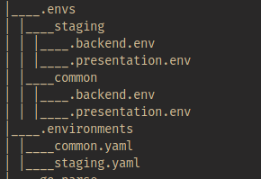

# Welcome to Go-environment builder package

### Author: Nimish Kashyap

**Current Version**: v0.0.1 Alpha

#### Introduction

This package provides a scalable solution to environment variables management.

- Suitable for Containerized applications.
- Easy to use
- Easy integration with CI/CD pipelines.

Instructions:

1. Clone the repository

```
git clone github.com/NimishKashyap/go-parse-env
```

2. Build the Go binary according to your system.

```
go build <options> .
```

3. Create `.environments` directory in the root of your project.
4. Create necessary yaml files inside it.
5. Run binary using: `./go-parse`

<br/>

**SAMPLE INPUT FORMAT**:

- `.environments/staging.yaml`:

```{yaml}
backend:
  bucket: "my-terraform-state"
  key: "my-terraform-state"
  region: "us-east-1"
  dynamodb_table: "my-terraform-state-lock"
  profile: "my-terraform-state"
  workspace_key_prefix: "my-terraform-state"

presentation:
  s3_bucket: "my-terraform-state"
  s3_access_key: "Random access key"

```

- `.environments/common.yaml`:

```{yaml}
backend:
  bucket: "my-terraform-state"
  key: "my-terraform-state"
  region: "us-east-1"
  dynamodb_table: "my-terraform-state-lock"
  profile: "my-terraform-state"
  workspace_key_prefix: "my-terraform-state"

presentation:
  s3_bucket: "my-terraform-state"
  s3_access_key: "Random access key"

```

<br/>

**OUTPUT FORMAT:**

- `.envs/common/backend.env`

```
REGION=us-east-1
DYNAMODB_TABLE=my-terraform-state-lock
PROFILE=my-terraform-state
WORKSPACE_KEY_PREFIX=my-terraform-state
BUCKET=my-terraform-state
KEY=my-terraform-state
```

- `.envs/common/presentation.env`

```
REGION=us-east-1
DYNAMODB_TABLE=my-terraform-state-lock
PROFILE=my-terraform-state
WORKSPACE_KEY_PREFIX=my-terraform-state
BUCKET=my-terraform-state
KEY=my-terraform-state
```

**Folder structure**:
<br />

